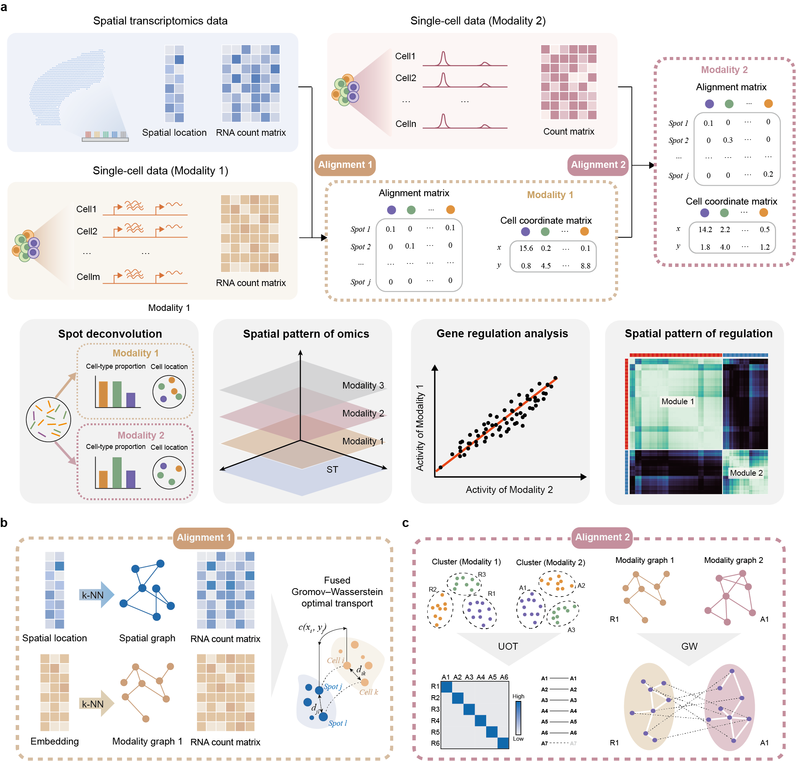

# SIMO v1.0.0 </a>

# Spatial integration of multi-omics single-cell data

### Penghui Yang, ..., Xiaohui Fan*


SIMO is a computational method, which perform Spatial Integration of Multi-Omics single-cell datasets through probabilistic alignment.



## Requirements and Installation
### Installation of SIMO

[](https://pypi.org/project/anndata/0.9.2/)
[](https://pypi.org/project/h5py/3.10.0/)
[](https://pypi.org/project/python-igraph/0.10.8/)
[](https://pypi.org/project/jupyterlab/3.6.7/)
[](https://pypi.org/project/kaleido/0.2.1/)
[](https://pypi.org/project/louvain/0.7.1/)
[](https://pypi.org/project/matplotlib/3.5.2/)
[](https://pypi.org/project/networkx/3.1/)
[](https://pypi.org/project/notebook/6.3.0/)
[](https://pypi.org/project/POT/0.8.2/)
[](https://pypi.org/project/numpy/1.22.4/)
[](https://pypi.org/project/pandas/1.4.3/)
[](https://pypi.org/project/PyComplexHeatmap/1.6.7/)
[](https://pypi.org/project/scikit-learn/1.2.0/)
[](https://pypi.org/project/scipy/1.8.1/)
[](https://pypi.org/project/scanpy/1.9.1/)
[](https://pypi.org/project/scikit-misc/0.1.4/)
[](https://pypi.org/project/leidenalg/0.10.0/)

```
# We recommend using Anaconda, and then you can create a new environment.
# Create and activate Python environment
conda create -n simo python=3.8
conda activate simo
# Installation of SIMO
pip install simo-omics
```
## Tutorials

We have applied SIMO on datasets, here we give step-by-step tutorials for all application scenarios. And preprocessed datasets used can be downloaded from [Google Drive](https://drive.google.com/drive/folders/1smPbTfkkd_Pvk0hXzIZrXk55aEbnXPVl?usp=sharing).


* [Spatial integration of the mouse cortex](tutorial/mouse_brain.ipynb)
* [Spatial integration of the human myocardial infarction](tutorial/human_heart.ipynb)

## About
Should you have any questions, please feel free to contact the author of the manuscript, Mr. Penghui Yang (yangph@zju.edu.cn).

## References
